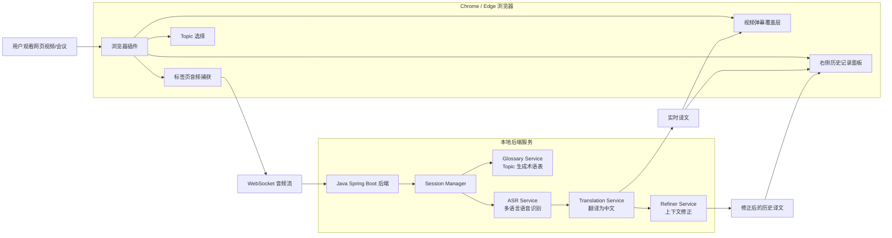

# AI Simultaneous Interpretation Assistant

AI 同声传译浏览器插件，面向网页视频、网页会议和在线课程场景。用户在原网页继续观看内容，插件在视频画面上显示实时中文弹幕，并在右侧面板保留完整原文和译文历史记录。系统会根据后续上下文修正前文翻译，修正过的历史记录保持高亮。

## 项目目标

本项目第一版聚焦浏览器插件形态。核心目标为解决用户观看网页视频时无法同时方便查看实时翻译的问题。

第一版能力：

- 捕获当前浏览器标签页音频
- 支持多语言语音识别
- 将识别内容实时翻译为简体中文
- 在视频区域叠加弹幕式翻译
- 在右侧面板保留原文和译文历史记录
- 根据上下文修正前文翻译
- 修正过的历史记录持续高亮
- 根据 topic 自动生成术语表，提高专业内容翻译一致性

## 产品形态

```text
Chrome / Edge 浏览器插件 + Java Spring Boot 本地后端
```

插件负责：

- 捕获当前标签页音频
- 注入视频弹幕层
- 展示右侧历史记录面板
- 管理 topic 选择
- 与后端进行 WebSocket 通信

Java 后端负责：

- 接收音频流
- 多语言 ASR
- 多语言到中文翻译
- 上下文修正
- topic 术语表生成
- 实时会话管理

## 项目架构



## 核心交互

1. 用户打开网页视频或网页会议。
2. 用户点击插件并选择 topic。
3. 插件捕获当前标签页音频。
4. 后端实时识别音频并翻译为中文。
5. 插件在视频区域显示实时中文弹幕。
6. 插件在右侧面板追加原文和译文。
7. 后端结合最近上下文修正历史翻译。
8. 插件更新右侧对应记录，并将修正过的记录保持高亮。

## 右侧历史记录设计

右侧面板保持简洁，每条记录只展示：

```text
原文：...
译文：...
```

显示规则：

- 未修正记录正常显示
- 修正过的记录保持高亮
- 不展示修正原因
- 不展示状态标签
- 不展示置信度

## 实时弹幕设计

弹幕用于辅助用户跟随视频节奏：

- 展示当前或最近一句中文翻译
- 优先保证低延迟
- 不长期保留历史
- 不强行回改已经消失的弹幕
- 错误修正进入右侧历史记录

## 修正策略

系统采用“实时弹幕 + 历史精修”的设计：

```text
音频输入
  -> 实时识别
  -> 快速翻译
  -> 视频弹幕展示
  -> 写入右侧历史记录
  -> 后台上下文修正
  -> 更新历史记录并高亮
```

这可以解决实时同传中的核心矛盾：

- 弹幕负责实时跟随。
- 历史记录负责准确沉淀。
- 已经播放过去的错误弹幕不再打断用户，而是在右侧历史记录中修正并高亮。

## 技术栈建议

### 浏览器插件

- Manifest V3
- TypeScript
- Content Script
- Side Panel / Extension Panel
- WebSocket Client
- Audio Capture

### 后端

- Java 17
- Spring Boot
- Spring WebSocket
- Jackson
- WebClient / HTTP Client

### AI 能力

- ASR：多语言语音识别
- Translation：多语言到简体中文
- Refiner：上下文修正
- Glossary Generator：根据 topic 自动生成术语表

## 第一版边界

支持：

- 网页视频
- 网页会议
- 当前标签页音频捕获
- 视频上实时弹幕
- 右侧历史记录
- 修正高亮
- topic 自动术语表

暂不支持：

- 本地播放器音频
- 全系统音频
- 桌面悬浮窗
- 用户登录
- 云端同步
- 语音播报
- 手动术语表编辑
- 字幕导出

## 文档

- [docs/PRD.md](./docs/PRD.md)：产品需求文档
- [docs/API.md](./docs/API.md)：接口文档
- [docs/TECHNICAL_DESIGN.md](./docs/TECHNICAL_DESIGN.md)：技术设计文档
- [docs/LOCAL_MODEL.md](./docs/LOCAL_MODEL.md)：本地模型接入说明

## 当前工程结构

```text
AI_Simultaneous_Interpretation_Assistant/
  README.md
  docs/
  backend/
  extension/
```

## 演示链路

当前版本实现了标签页音频捕获骨架，并保留后端 mock 字幕输出，方便先验证插件交互和字幕修正链路：

1. 启动 Java 后端。
2. 在 Chrome / Edge 中加载 `extension/` 插件目录。
3. 打开任意网页。
4. 点击插件图标打开右侧面板。
5. 点击“开始”。
6. 插件尝试捕获当前标签页音频。
7. 插件将音频切片发送给后端 WebSocket。
8. 后端当前根据音频 chunk 数量模拟返回字幕和修正事件。
9. 页面底部显示实时弹幕。
10. 右侧面板追加原文和译文。
11. 后端推送修正事件后，对应历史记录持续高亮。

## 后端运行

```powershell
cd backend
mvn spring-boot:run
```

如果本机 `mvn` 不在 PATH，可以使用本地 Maven 绝对路径运行。

## 插件加载

1. 打开 Chrome / Edge 扩展管理页面。
2. 开启开发者模式。
3. 选择“加载已解压的扩展程序”。
4. 选择项目下的 `extension/` 目录。
5. 确认 Java 后端运行在 `http://127.0.0.1:8080`。

## 当前状态

项目已完成需求确认、产品方案设计、接口设计、技术方案设计、mock 版 Java 后端、Ollama 本地模型 provider、浏览器插件骨架、标签页音频捕获链路骨架，以及后端 REST / WebSocket 集成测试。
