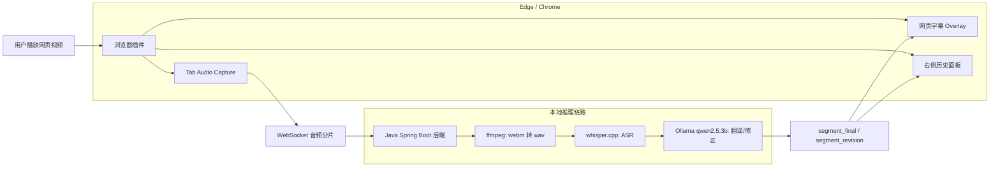

# AI Simultaneous Interpretation Assistant

一个面向网页视频的本地实时翻译插件：捕获当前浏览器标签页音频，后端用 whisper.cpp 做语音识别，用 Ollama 本地模型翻译成中文，并在网页中显示实时字幕，同时在右侧面板保留历史翻译记录。后续修正过的历史记录会高亮显示。

## 当前能力

- 浏览器插件：Edge / Chrome Manifest V3。
- 网页字幕：在当前视频网页底部显示实时翻译弹幕。
- 右侧面板：显示原文和译文历史记录。
- 本地后端：Java 17 + Spring Boot + WebSocket。
- 本地 ASR：ffmpeg + whisper.cpp。
- 本地翻译：Ollama，默认模型 `qwen2.5:3b`。
- 调试兜底：音频捕获失败时可切换 mock 演示，后端日志会输出 ASR 失败原因。

## 一键启动

后端已经配置为使用本地 Ollama：

```powershell
cmd.exe /c scripts\launch-backend-ollama.cmd
```

打开加载插件的 Edge 测试窗口：

```powershell
cmd.exe /c scripts\launch-extension-edge.cmd
```

也可以直接一键启动后端和测试浏览器：

```powershell
cmd.exe /c scripts\start-all-edge.cmd
```

打开窗口后进入任意视频网页，点击工具栏里的 `AI 同声传译助手`，在侧边栏点击 `开始`。等待约 5 到 10 秒后，页面底部会出现翻译字幕，侧边栏会开始累积历史翻译。

## 运行依赖

- Java 17
- Maven
- Ollama
- `qwen2.5:3b`
- ffmpeg
- whisper.cpp Windows x64
- whisper.cpp 模型 `ggml-base.bin`

确认 Ollama 模型：

```powershell
ollama list
ollama pull qwen2.5:3b
```

确认后端状态：

```powershell
Invoke-RestMethod -Uri http://127.0.0.1:8080/api/health
Invoke-RestMethod -Uri http://127.0.0.1:8080/api/ai/provider
```

## 架构



## 项目结构

```text
AI_Simultaneous_Interpretation_Assistant/
  backend/      Java Spring Boot 后端
  extension/    Manifest V3 浏览器插件
  docs/         PRD、API、技术设计和本地模型说明
  scripts/      本地启动脚本
  tools/        本地工具和模型，已被 git 忽略
```

## 文档

- [PRD](docs/PRD.md)
- [API](docs/API.md)
- [技术设计](docs/TECHNICAL_DESIGN.md)
- [本地模型说明](docs/LOCAL_MODEL.md)

## 测试

后端测试：

```powershell
& 'J:\Environment\apache-maven-3.9.16\bin\mvn.cmd' test
```

插件脚本语法检查：

```powershell
node --check extension/src/panel.js
node --check extension/src/background.js
node --check extension/src/offscreen.js
node --check extension/src/content.js
```
