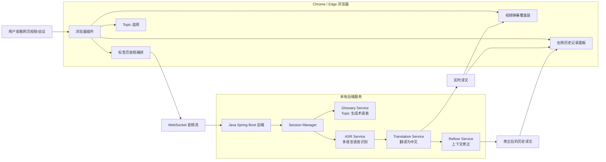

# AI 同声传译浏览器插件 PRD

## 1. 项目背景

用户在观看外语网页视频、技术分享、国际会议、在线课程或网页会议时，经常需要实时理解内容。传统字幕或翻译工具通常存在两个问题：

- 只能逐句翻译，缺少对前文错误的修正能力。
- 翻译结果与原观看页面割裂，用户需要在多个窗口之间切换。

本项目拟开发一款浏览器插件，在用户观看网页内容时直接提供实时中文翻译弹幕，并在右侧面板保留完整的原文与译文历史记录。系统重点突出上下文修正能力：实时弹幕优先保证跟随视频节奏，历史记录则在后续上下文明确后自动修正并高亮显示。

## 2. 产品定位

AI 同声传译浏览器插件，面向网页视频、网页会议和在线课程场景，提供多语言音频到中文的实时翻译辅助。

第一版产品形态：

- Chrome / Edge 浏览器插件
- Java Spring Boot 本地后端
- 插件负责音频捕获、弹幕覆盖、右侧历史记录展示
- 后端负责 ASR、翻译、上下文修正和术语表生成

## 3. 目标用户

- 观看外语技术分享、公开课、会议视频的学生和开发者
- 需要参加外语线上会议的职场用户
- 需要快速理解多语言视频内容的学习者
- 训练营/课程项目评审人员

## 4. 核心价值

1. 用户无需离开原视频页面，即可看到实时中文翻译。
2. 视频区域显示弹幕式翻译，降低语言理解门槛。
3. 右侧面板保存完整原文和译文，便于回看。
4. 系统根据后续上下文修正前文翻译错误，并在历史记录中持续高亮。
5. 根据用户选择的 topic 自动生成术语表，提高专业内容翻译一致性。

## 5. 范围说明

### 5.1 第一版支持

- 浏览器插件安装和启动
- 捕获当前网页标签页音频
- 多语言语音识别
- 多语言到中文翻译
- 视频画面上叠加实时弹幕式中文翻译
- 右侧面板展示历史记录
- 历史记录格式：原文 + 译文
- 经过修正的历史记录保持高亮
- 用户选择或输入 topic
- 系统根据 topic 自动生成术语表
- 后端基于最近若干句上下文进行修正

### 5.2 第一版暂不支持

- 本地播放器音频捕获
- 全系统音频捕获
- 桌面悬浮窗
- 用户登录
- 云端同步
- 语音播报译文
- 手动编辑术语表
- 显示修正原因、修正状态或置信度

## 6. 使用场景

### 6.1 网页视频翻译

用户打开外语视频网页，启动插件，插件捕获当前标签页音频，将实时中文翻译以弹幕形式显示在视频区域，同时右侧记录完整原文与译文。

### 6.2 网页会议辅助

用户参加网页会议时启动插件，插件实时识别会议音频并翻译为中文。用户可以通过右侧面板回看前文。

### 6.3 技术课程学习

用户选择 topic 为“AI 技术分享”或“编程课程”，系统自动生成相关术语表，使 technical terms 的翻译更稳定。

## 7. 用户流程

1. 用户打开外语网页视频或网页会议。
2. 用户点击浏览器插件图标。
3. 插件展示启动面板。
4. 用户选择或输入 topic。
5. 用户授权插件捕获当前标签页音频。
6. 插件开始向本地 Java 后端发送音频流。
7. 后端返回实时识别和翻译结果。
8. 插件在视频区域显示实时中文弹幕。
9. 插件在右侧面板追加历史记录。
10. 后端根据上下文发现前文翻译可修正时，推送修正结果。
11. 插件更新右侧历史记录中对应内容，并保持高亮。

## 8. 功能需求

### 8.1 音频捕获

- 插件应支持捕获当前浏览器标签页音频。
- 用户启动翻译前应明确授权音频捕获。
- 音频应以流式方式发送至后端。
- 当用户停止翻译或关闭页面时，音频捕获应停止。

### 8.2 Topic 选择

- 插件应提供 topic 选择或输入入口。
- 系统应根据 topic 自动生成初始术语表。
- 术语表用于辅助 ASR 修正、翻译和上下文精修。
- 第一版无需展示完整术语表编辑界面。

示例 topic：

- 通用会议
- AI 技术分享
- 编程课程
- 医学会议
- 金融报告
- 学术讲座

### 8.3 实时弹幕翻译

- 插件应在视频区域叠加中文翻译弹幕。
- 弹幕应优先展示当前或最近一句译文。
- 弹幕不负责长期保留历史内容。
- 弹幕允许为低延迟版本，不强制回改已经消失的内容。
- 弹幕应避免遮挡视频核心区域，可放置在视频底部或中下方。

### 8.4 右侧历史记录

- 插件应提供右侧历史翻译面板。
- 每条记录只展示：
  - 原文
  - 译文
- 未修正记录正常显示。
- 修正过的记录保持高亮。
- 第一版不展示修正原因、状态标签、置信度或时间轴。
- 历史记录应按生成顺序排列。

### 8.5 上下文修正

- 后端应维护最近若干句原文和译文上下文。
- 当新上下文到达后，系统应判断最近历史翻译是否需要修正。
- 如需修正，后端应推送被修正记录的 ID 和新译文。
- 插件收到修正后应更新右侧历史记录，并高亮该记录。
- 第一版建议修正窗口为最近 5-10 句。

### 8.6 多语言识别与翻译

- 系统应支持多语言输入。
- 系统应自动识别源语言。
- 输出语言固定为简体中文。
- 翻译应结合 topic 和术语表。

### 8.7 启停控制

- 插件应提供开始、暂停、停止功能。
- 停止后应释放音频捕获资源。
- 用户可以清空当前历史记录。

## 9. 非功能需求

### 9.1 实时性

- 弹幕翻译应尽量低延迟。
- 第一版目标延迟为 2-5 秒。
- 可接受短延迟以换取更稳定的识别和翻译。

### 9.2 可用性

- 用户应能在原网页中直接使用插件。
- 插件 UI 应轻量，不干扰原视频播放。
- 右侧面板应简洁，重点展示原文和译文。

### 9.3 可扩展性

- 后端 AI 能力应模块化，便于替换 ASR、翻译和修正模型。
- 插件 UI 与后端通信协议应清晰。
- 后续可扩展为桌面软件，支持系统音频和本地播放器。

### 9.4 隐私

- 第一版默认不保存用户音频文件。
- 历史记录默认仅存在当前会话。
- 如需持久化，应由用户主动触发。

## 10. 技术方案

### 10.1 前端插件

- Manifest V3 浏览器插件
- Content Script：向网页注入弹幕层
- Side Panel / 插件面板：展示历史翻译记录
- Background Service Worker：管理插件生命周期和消息转发
- Audio Capture：捕获当前标签页音频
- WebSocket Client：与 Java 后端实时通信

### 10.2 Java 后端

- Java 21
- Spring Boot
- Spring WebSocket
- WebClient / HTTP Client 调用外部 AI 服务
- Session Manager 管理实时会话
- Glossary Service 根据 topic 生成术语表
- ASR Service 负责多语言语音识别
- Translation Service 负责多语言到中文翻译
- Refiner Service 负责上下文修正

### 10.3 AI 流程

```text
标签页音频
  -> 音频切片
  -> 多语言 ASR
  -> 快速翻译
  -> 实时弹幕
  -> 写入历史记录
  -> 上下文修正
  -> 更新历史记录并高亮
```

## 11. 项目架构图



## 12. 数据结构建议

### 12.1 历史记录片段

```json
{
  "id": "seg_001",
  "sourceText": "The model reduces inference latency.",
  "translation": "该模型降低了推理延迟。",
  "revised": false
}
```

### 12.2 修正消息

```json
{
  "type": "revision",
  "id": "seg_001",
  "sourceText": "The model reduces inference latency.",
  "translation": "该模型降低了推理延迟。",
  "revised": true
}
```

## 13. 验收标准

第一版完成后，应满足：

1. 用户可以在浏览器中安装并启动插件。
2. 插件可以捕获当前标签页音频。
3. 系统可以识别多语言语音并翻译为中文。
4. 视频画面上可以看到实时中文弹幕。
5. 右侧面板可以持续追加原文和译文。
6. 当系统修正前文翻译时，右侧对应记录会更新并保持高亮。
7. 用户可以选择或输入 topic。
8. 系统可以根据 topic 生成术语表并用于翻译。
9. 用户可以停止翻译并释放音频捕获。

## 14. 后续扩展

- 桌面端软件，支持本地播放器和系统音频。
- 手动编辑术语表。
- 字幕导出为 TXT / SRT。
- 会议纪要生成。
- 用户自定义弹幕样式。
- 多语言输出选择。
- 翻译质量评估和置信度展示。
