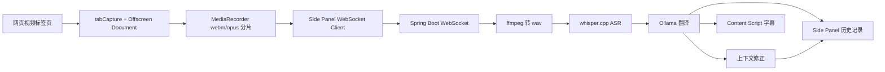

# 技术设计

## 目标

实现一个可本地运行的网页视频实时翻译插件。用户在 Edge / Chrome 中播放任意网页视频，插件捕获当前标签页音频，将音频发送到 Java 后端，后端完成 ASR、翻译和修正，再把结果返回给网页字幕和右侧历史面板。

## 架构图



## 浏览器插件

### Background Service Worker

- 打开 side panel。
- 调用 `chrome.tabCapture.getMediaStreamId` 获取当前标签页音频流 id。
- 创建 offscreen document。
- 将音频捕获请求转发给 offscreen document。
- 捕获失败时把错误返回给面板。

### Offscreen Document

- 使用 `navigator.mediaDevices.getUserMedia` 消费 tab audio stream id。
- 用 `MediaRecorder` 每 5 秒生成一个完整 `audio/webm;codecs=opus` 分片。
- 将分片转为 base64，通过 runtime message 发送给 side panel。
- 创建本地 Audio 元素保持原标签页声音可听。

### Side Panel

- 创建后端 session。
- 建立 WebSocket。
- 发送 `audio_start`、`audio_chunk`、`audio_end`。
- 展示连接状态、AI provider、历史翻译。
- 收到修正消息后把对应历史记录保持高亮。
- 开始前主动注入 content script 和 CSS，让已打开网页无需刷新。

### Content Script

- 在页面底部创建字幕 overlay。
- 接收 `subtitle_show` 和 `subtitle_clear` 消息。
- 只负责展示，不参与音频和模型逻辑。

## 后端

### SessionService

- 创建和管理解释会话。
- 保存 topic、语言和最近片段。

### WebSocket Handler

- 校验 `sessionId`。
- 设置较大的 WebSocket message size limit，支持 base64 音频分片。
- 分发音频消息到解释服务。

### WhisperAsrService

- 接收 base64 webm 音频。
- 写入临时目录。
- 调用 ffmpeg 转为 16k 单声道 wav。
- 调用 whisper.cpp 生成 transcript。
- 清理临时文件。
- 输出 ASR 成功文本和失败原因日志。

### AI Provider

当前有两个 provider：

- `mock`：用于无模型演示和测试。
- `ollama`：调用本地 Ollama 模型翻译和修正。

默认运行脚本使用：

```text
AI_PROVIDER=ollama
AI_OLLAMA_MODEL=qwen2.5:3b
```

## 修正策略

实时弹幕已经展示过的内容不回放、不倒退。修正结果只更新右侧历史面板：

- 首次转写和翻译返回 `segment_final`。
- 后端基于当前 segment 和上下文生成修正。
- 如果有修正，返回 `segment_revision`。
- 面板用同一个 segment id 替换译文，并保持高亮。

这样可以兼顾实时性和“系统有自我修正能力”的展示重点。

## 延迟来源

总延迟大致为：

```text
分片时长 + ffmpeg 转码 + whisper.cpp 转写 + Ollama 翻译
```

当前分片时长为 5 秒。若需要更低延迟，可以把 `extension/src/offscreen.js` 中的 5000ms 调为 3000ms。
