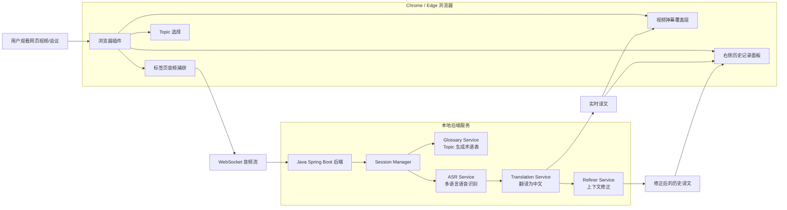
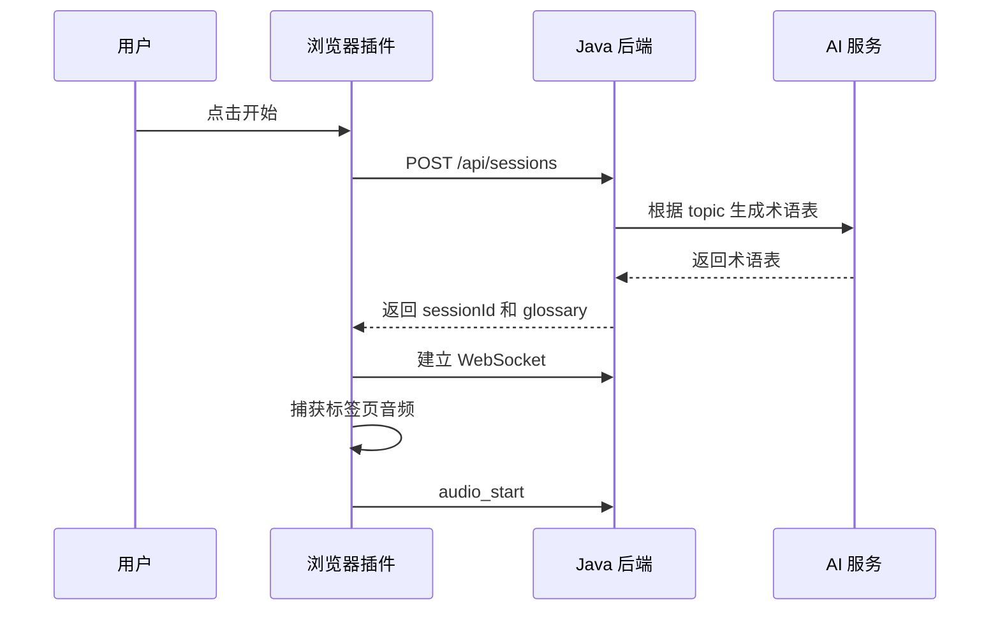
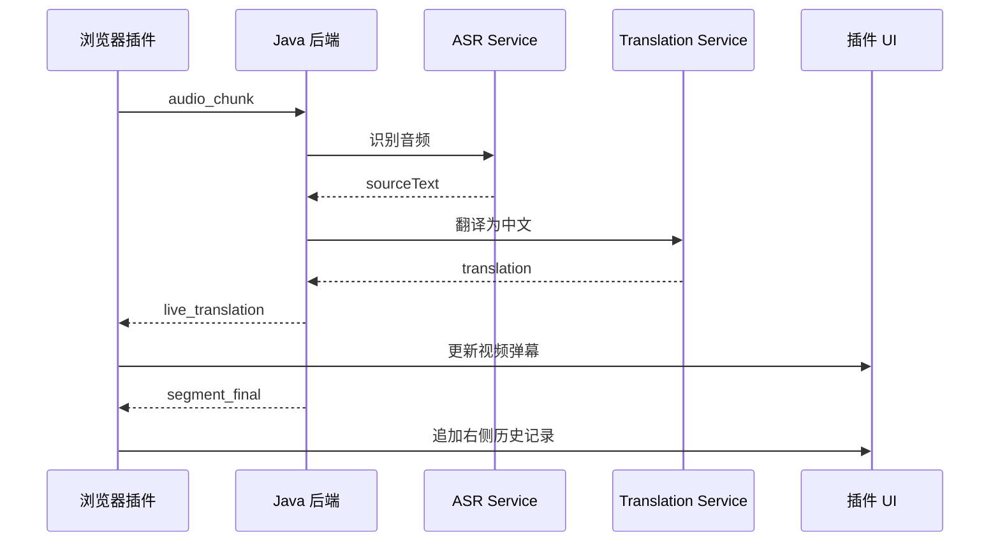
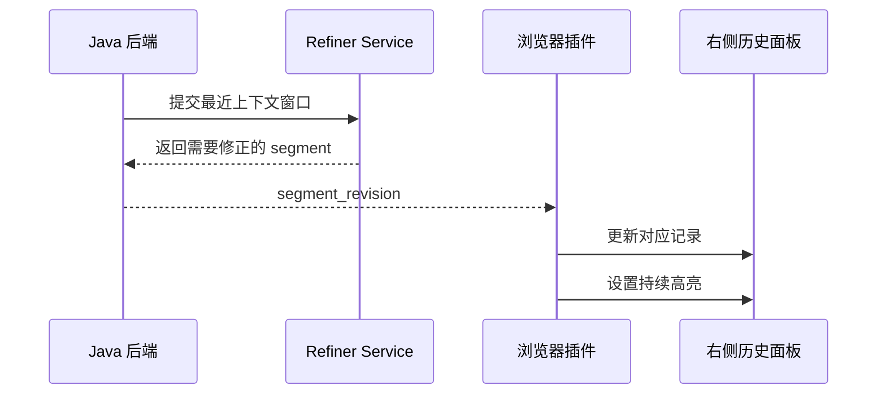

# 技术设计文档

## 1. 总体方案

项目采用浏览器插件 + Java 本地后端的架构。

浏览器插件运行在用户正在观看的视频页面中，负责捕获当前标签页音频、注入视频弹幕层、展示右侧历史记录面板。Java 后端运行在本地，负责音频处理、AI 服务调用、上下文修正和会话管理。

第一版重点不是做完整桌面软件，而是先覆盖网页视频、网页会议和在线课程场景。

## 2. 架构图



## 3. 模块划分

### 3.1 浏览器插件

#### Background Service Worker

职责：

- 管理插件生命周期。
- 创建和维护与后端的 WebSocket 连接。
- 协调 content script、side panel 和音频捕获模块之间的消息。
- 处理开始、暂停、停止等控制事件。

#### Content Script

职责：

- 注入视频弹幕覆盖层。
- 定位页面中的主视频元素。
- 接收实时翻译消息并更新弹幕。
- 避免影响原网页播放行为。

#### Side Panel / Extension Panel

职责：

- 展示 topic 选择入口。
- 展示右侧历史记录。
- 每条历史记录只展示原文和译文。
- 修正过的记录保持高亮。
- 提供开始、停止、清空操作。

#### Audio Capture

职责：

- 捕获当前标签页音频。
- 将音频切片发送给后端。
- 处理用户授权和停止采集。

第一版可先使用插件侧可行的标签页音频捕获能力。若浏览器 API 兼容性导致实现受限，可降级为用户授权页面/标签页音频共享。

### 3.2 Java 后端

#### Session Manager

职责：

- 创建和销毁会话。
- 管理每个会话的 topic、术语表、上下文窗口和历史记录。
- 将 AI 流程输出转换为统一事件推送给插件。

#### Audio Stream Handler

职责：

- 接收 WebSocket 音频片段。
- 维护音频 sequence。
- 将音频片段送入 ASR 模块。

#### ASR Service

职责：

- 调用多语言语音识别能力。
- 自动识别源语言。
- 输出临时识别和稳定识别文本。

#### Translation Service

职责：

- 将源语言文本翻译为简体中文。
- 使用 topic 和术语表增强翻译一致性。
- 支持流式翻译输出，用于视频弹幕。

#### Refiner Service

职责：

- 维护最近 5-10 条上下文。
- 根据最新上下文检查前文原文和译文是否需要修正。
- 输出修正后的历史记录。
- 不向前端暴露修正原因，第一版只返回修正后的原文和译文。

#### Glossary Service

职责：

- 根据 topic 生成初始术语表。
- 在会话过程中根据高频词、专有名词或翻译不稳定词补充候选术语。
- 将术语表提供给 ASR、Translation 和 Refiner 使用。

## 4. 核心流程

### 4.1 启动流程



### 4.2 实时翻译流程



### 4.3 上下文修正流程



## 5. 修正策略

第一版采用“弹幕实时、历史精修”的策略。

### 5.1 弹幕层

- 展示当前或最近一句译文。
- 优先低延迟。
- 已消失的弹幕不回放、不强行修改。
- 允许存在临时误差。

### 5.2 历史记录

- 每条记录保存原文和译文。
- 历史记录是准确性沉淀区。
- 当后端发现可修正内容时，更新对应记录。
- 修正过的记录持续高亮。

### 5.3 修正窗口

建议第一版维护最近 8 条记录：

```text
contextWindow = last 8 segments
```

每当新增稳定片段时，后台触发一次修正检查。为了控制成本，可以只检查最近 3-5 条可能被影响的记录。

## 6. 流式生成策略

流式翻译用于提高感知实时性。

建议：

- ASR 输出稳定片段后，翻译模型使用流式返回。
- 插件收到部分译文后更新弹幕。
- 历史记录只在 `segment_final` 到达后追加。
- 上下文修正只作用于历史记录，不影响已经消失的弹幕。

流式生成不能完全解决实时性问题，因为总延迟还包括音频切片、语音识别和断句。第一版应优先保证整体链路稳定，再优化 token 级流式显示。

## 7. 数据模型

### 7.1 Segment

```java
public class Segment {
    private String id;
    private String sourceText;
    private String translation;
    private boolean revised;
}
```

### 7.2 Session

```java
public class InterpretationSession {
    private String sessionId;
    private String topic;
    private String sourceLanguage;
    private String targetLanguage;
    private List<GlossaryTerm> glossary;
    private Deque<Segment> contextWindow;
}
```

### 7.3 GlossaryTerm

```java
public class GlossaryTerm {
    private String source;
    private String target;
}
```

## 8. 建议目录结构

```text
AI_Simultaneous_Interpretation_Assistant/
  README.md
  docs/
    PRD.md
    API.md
    TECHNICAL_DESIGN.md
  backend/
    pom.xml
    src/main/java/...
  extension/
    manifest.json
    src/
      background/
      content/
      panel/
      shared/
```

## 9. 后端接口分层

```text
controller/
  SessionController
  HealthController
websocket/
  InterpretationWebSocketHandler
service/
  SessionService
  AudioStreamService
  AsrService
  TranslationService
  RefinerService
  GlossaryService
model/
  InterpretationSession
  Segment
  GlossaryTerm
  WsMessage
config/
  WebSocketConfig
  AiProviderConfig
```

## 10. 插件消息分层

```text
background/
  websocket-client.ts
  session-controller.ts
  audio-capture.ts
content/
  subtitle-overlay.ts
  video-detector.ts
panel/
  App.tsx
  history-list.tsx
  topic-selector.tsx
shared/
  messages.ts
  segment.ts
```

## 11. 风险与处理

### 11.1 标签页音频捕获兼容性

风险：不同浏览器对插件音频捕获支持不同。

处理：

- 第一版优先支持 Chrome / Edge。
- 若无法直接捕获，提供用户授权共享标签页音频的降级方案。

### 11.2 实时性和准确性冲突

风险：低延迟会导致断句和翻译不稳定。

处理：

- 弹幕允许轻量误差。
- 历史记录通过上下文修正保证质量。

### 11.3 AI 服务成本

风险：每条字幕都触发修正会增加调用成本。

处理：

- 只对最近上下文窗口做修正。
- 合并短句后再触发修正。
- 对修正频率做节流。

### 11.4 页面结构复杂

风险：不同视频网站 DOM 结构不同，弹幕层定位可能失败。

处理：

- 第一版先检测页面主 `video` 元素。
- 找不到视频时使用固定页面底部字幕层。
- 后续针对主流网站做适配。

## 12. 第一版开发顺序

1. 初始化 Java Spring Boot 后端。
2. 实现健康检查和会话创建接口。
3. 实现 WebSocket 基础通信。
4. 初始化浏览器插件工程。
5. 实现右侧面板和 topic 选择。
6. 实现视频弹幕覆盖层。
7. 接入音频捕获和音频流发送。
8. 接入 ASR 和翻译服务。
9. 实现历史记录追加。
10. 实现上下文修正和高亮更新。
11. 完成端到端演示。
